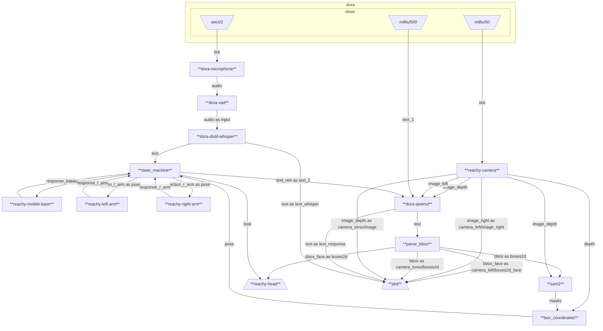

Reachy grasping demo showcase how by combining multiple AI models together we can create a robot able to grasp object on a table from our speech autonomously.

This is performed with 100% open source code.

This approach also has the advantage of not be dependent on any environemnt finetuning meaning it can work pretty much anywhere with any robot out of the box.

:::warning

## Grasping limitation

- Grasping is limited to small concave object that fits in reachy's claws.
- Grasping always has a fixed rotation angle pose.
- Current trajectory are predetermined.

By universal grasping, we want to focus on the fact that the object can be any object as long as we can define it using a generalistic prompt as opposed to previous approach dependant on predefined label.

:::

## Main ideas

- Convert audio to a sequence using **Silero VAD**
- Convert the sequence to text using **OpenAI Whisper**
- Convert the user's text and the rgb image from **Orbecc Gemini 336 Camera (camera torso)** into a bounding box using **QwenVL 2.5**
- Convert the bounding box into a masks using **Meta SAM2**.
- Convert the masks and the depth image of **Orbecc Gemini 336 Camera** into a position using efficient **rust** code powered by **dora-rs.**
- Go to the position using inverse kinematics provided by **Pollen Robotics**.
- Go to predetermined position and come back in a scripted way. (In the future we plan to automate this. )

---

## Demo features that are technically not necessary

- We have added head movement by searching for people when idle.
- We have made the head look at the predicted bounding box when the object is identified.
- We have made the robot turn left/right and releasing object into the box in a predetermined way in order to make people imagine follow up possibility.
- We have used both arms of the robot also using only one would also work, although, the grasping area given a fixed mobile base would be greatly reduced.

## Source Code

All the source code and instructions are contained within dora-rs repository: https://github.com/dora-rs/dora/pull/784

The code is 100% open source and is aimed at being 100% reusable on other hardware using dora-rs by just replacing: `reachy-left-arm, reachy-right-arm, reachy-camera and reachy-head`. Albeit, porting this code might not be 100% easy as of now, and further work need to be done.

## Annex: Rerun

<iframe src="https://app.rerun.io/version/0.21.0/index.html?url=https://huggingface.co/datasets/haixuantao/rerun_dataset/resolve/main/final_data.rrd" width="100%" height="700px"></iframe>

In the above iframe, the important information are:

- `/text_whisper`: correspond to **whisper** audio transcription.
- `/text_response`: correspond to the bounding box given as plain text from **QwenVL 2.5**
- `camera_torso`: correspond to **Orbecc Gemini 336 Depth Camera** rgb image.
- `camera_torso` bounding box: correspond to the QwenVL bounding box projected on the image that is going to be used to grasp object. The prediction is done at regular interval and does not disappear. Sorry if it can be a bit confusing.
- `camera_left` bounding box: correspond to the QwenVL bounding box for detecting humans for head movement and is strictly a gimmick feature.

## Annex: Graph of nodes running in parallel

The above graph correspond to the exact communication channels between the nodes that are running concurrently.

## Annex: Video

<video controls src="https://huggingface.co/datasets/haixuantao/rerun_dataset/resolve/main/761752120155.mp4" width="100%"  ></video>

In case you want to hire or buy reachy, you can send him an email at reachy@1ms.ai
