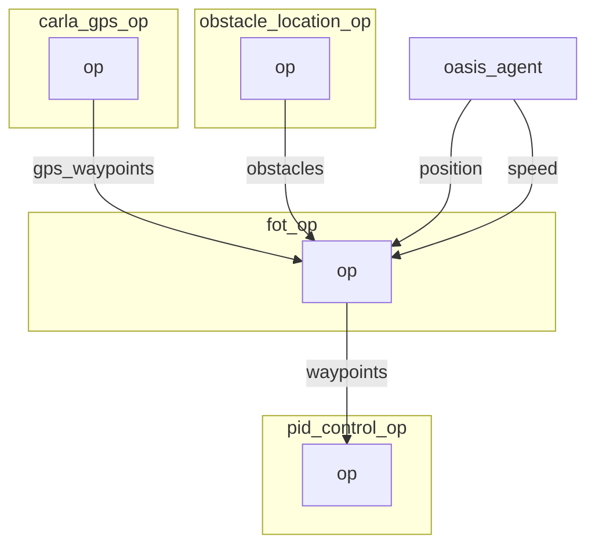

 
# FOT operator

The Frenet Optimal Planner Operator is based on [https://github.com/erdos-project/frenet_optimal_trajectory_planner/](https://github.com/erdos-project/frenet_optimal_trajectory_planner/) and wrap the different elements `obstacles`, `position`, `speed` ... into a frenet consumable format. 


FOT inputs are:
```python
initial_conditions = {
    "ps": 0,
    "target_speed": # The target speed
    "pos": # The x, y current position
    "vel": # The vx, vy current speed
    "wp": # [[x, y], ... n_waypoints ] desired waypoints
    "obs": # [[min_x, min_y, max_x, max_y], ... ] obstacles on the way
}
```
There is also a set of hyperparameters that are described below.

As our obstacles are defined as 3D dot we need to transform those dot into `[min_x, min_y, max_x, max_y]` format. We do that within the `get_obstacle_list` function. This approximation is very basic and probably need to be revisited.

The output is either a successful trajectory that we can feed into PID. Or it is a failure in which case we send the current position as waypoint.

## Graph Description

```yaml
  - id: fot_op
    operator:
      python: ../../operators/fot_op.py
      outputs:
        - waypoints
      inputs:
        position: oasis_agent/position
        speed: oasis_agent/speed
        obstacles: obstacle_location_op/obstacles
        gps_waypoints: carla_gps_op/gps_waypoints
```

## Graph Viz




<!---
This file is auto-generated using:
node .scripts/generate-python-operator-doc.js
-->

## Methods

### `__init__()`


<details>
  <summary>Source Code</summary>

```python
    def __init__(self):
        self.obstacles = np.array([])
        self.lanes = np.array([])
        self.position = []
        self.speed = []
        self.last_position = []
        self.waypoints = []
        self.gps_waypoints = np.array([])
        self.last_obstacles = np.array([])
        self.obstacle_metadata = {}
        self.gps_metadata = {}
        self.metadata = {}
        self.orientation = None
        self.outputs = []
        self.hyperparameters = {
            "max_speed": 25.0,
            "max_accel": 45.0,
            "max_curvature": 55.0,
            "max_road_width_l": 0.1,
            "max_road_width_r": 0.1,
            "d_road_w": 0.5,
            "dt": 0.5,
            "maxt": 5.0,
            "mint": 2.0,
            "d_t_s": 5,
            "n_s_sample": 2.0,
            "obstacle_clearance": 0.1,
            "kd": 1.0,
            "kv": 0.1,
            "ka": 0.1,
            "kj": 0.1,
            "kt": 0.1,
            "ko": 0.1,
            "klat": 1.0,
            "klon": 1.0,
            "num_threads": 0,  # set 0 to avoid using threaded algorithm
        }
        self.conds = {
            "s0": 0,
            "target_speed": TARGET_SPEED,
        }  # paste output from debug log


```

</details>

### `.on_event(...)`


<details>
  <summary>Source Code</summary>

```python

    def on_event(
        self,
        dora_event: dict,
        send_output: Callable[[str, bytes], None],
    ) -> DoraStatus:
        if dora_event["type"] == "INPUT":
            return self.on_input(dora_event, send_output)
        return DoraStatus.CONTINUE


```

</details>


### `.on_input(...)`


<details>
  <summary>Source Code</summary>

```python

    def on_input(
        self,
        dora_input: dict,
        send_output: Callable[[str, bytes], None],
    ):

        if dora_input["id"] == "position":
            self.last_position = self.position
            self.position = np.array(dora_input["value"]).view(np.float32)
            if len(self.last_position) == 0:
                self.last_position = self.position
            return DoraStatus.CONTINUE

        elif dora_input["id"] == "speed":
            self.speed = np.array(dora_input["value"]).view(np.float32)
            return DoraStatus.CONTINUE

        elif dora_input["id"] == "obstacles":
            obstacles = (
                np.array(dora_input["value"]).view(np.float32).reshape((-1, 5))
            )
            if len(self.last_obstacles) > 0:
                self.obstacles = np.concatenate(
                    [self.last_obstacles, obstacles]
                )
            else:
                self.obstacles = obstacles

        elif dora_input["id"] == "global_lanes":
            lanes = (
                np.array(dora_input["value"])
                .view(np.float32)
                .reshape((-1, 60, 3))
            )
            self.lanes = lanes
            return DoraStatus.CONTINUE

        elif "gps_waypoints" == dora_input["id"]:
            waypoints = np.array(dora_input["value"]).view(np.float32)
            waypoints = waypoints.reshape((-1, 3))[:, :2]
            self.gps_waypoints = waypoints
            return DoraStatus.CONTINUE

        if len(self.gps_waypoints) == 0:
            print("No waypoints")
            send_output(
                "waypoints",
                self.gps_waypoints.tobytes(),
                dora_input["metadata"],
            )
            return DoraStatus.CONTINUE

        elif len(self.position) == 0 or len(self.speed) == 0:
            return DoraStatus.CONTINUE

        [x, y, z, rx, ry, rz, rw] = self.position
        [_, _, yaw] = R.from_quat([rx, ry, rz, rw]).as_euler(
            "xyz", degrees=False
        )

        gps_obstacles = get_obstacle_list(
            self.position, self.obstacles, self.gps_waypoints
        )

        if len(self.lanes) > 0:
            lanes = get_lane_list(self.position, self.lanes, self.gps_waypoints)
            obstacles = np.concatenate([gps_obstacles, lanes])
        else:
            obstacles = gps_obstacles
        initial_conditions = {
            "ps": 0,
            "target_speed": self.conds["target_speed"],
            "pos": self.position[:2],
            "vel": (np.clip(LA.norm(self.speed), 0.5, 40))
            * np.array([np.cos(yaw), np.sin(yaw)]),
            "wp": self.gps_waypoints,
            "obs": obstacles,
        }

        (
            result_x,
            result_y,
            speeds,
            ix,
            iy,
            iyaw,
            d,
            s,
            speeds_x,
            speeds_y,
            misc,
            costs,
            success,
        ) = fot_wrapper.run_fot(initial_conditions, self.hyperparameters)

        if not success:
            initial_conditions["wp"] = initial_conditions["wp"][:5]
            print(f"fot failed. stopping with {initial_conditions}.")
            target_distance = LA.norm(
                self.gps_waypoints[-1] - self.position[:2]
            )
            print(f"Distance to target: {target_distance}")
            for obstacle in self.obstacles:
                print(
                    f"obstacles:{obstacle}, label: {LABELS[int(obstacle[-1])]}"
                )

            send_output(
                "waypoints",
                pa.array(np.array([x, y, 0.0], np.float32).view(np.uint8)),
                dora_input["metadata"],
            )
            return DoraStatus.CONTINUE

        self.waypoints = np.concatenate([result_x, result_y]).reshape((2, -1)).T

        self.outputs = np.ascontiguousarray(
            np.concatenate([result_x, result_y, speeds])
            .reshape((3, -1))
            .T.astype(np.float32)
        )
        send_output(
            "waypoints",
            pa.array(self.outputs.ravel().view(np.uint8)),
            dora_input["metadata"],
        )
        return DoraStatus.CONTINUE


```

</details>


<!---
This file is auto-generated using:
node .scripts/generate-python-operator-doc.js
-->
