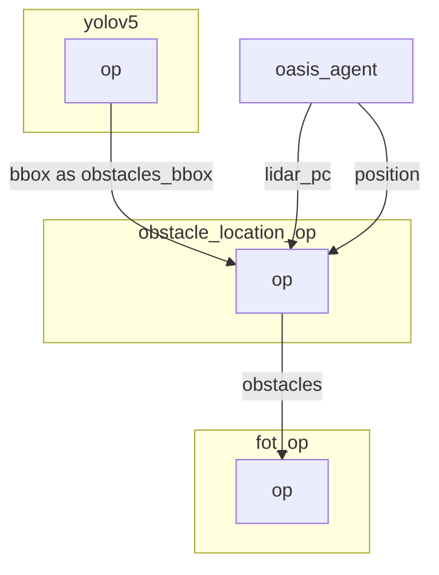

 
# Obstacle location operator

The obstacle location operator match bounding box with depth frame to find an approximative position of obstacles.

There is two logic within it:
- One is for the ground dot for lane detection.
- One is for bounding box obstacle localisation.

Both logic are based on he computation of the projection in 2D space of the lidar 3D point and then reusing the index to get the 3D position.

- In the case of ground dot detection, the approximation is based on a knnr, as we might not have enough data on the floor.
- In the case of bounding box, we use first quantile closest point within the bounding box to estimate the distance. We use the first quantile closest point to remove the noise.

The mecanism to project the lidar point cloud into a 2D is also used in the `plot.py` operator. You can use the input `lidar_pc` within it to help you debug.

## Inputs

- 2D Obstacles bounding box.

## Outputs

- 3D position of obstacles as dot.


## Graph Description

```yaml
  - id: obstacle_location_op
    operator: 
      outputs:
        - obstacles
      inputs:
        lidar_pc: oasis_agent/lidar_pc
        obstacles_bbox: yolov5/bbox
        position: oasis_agent/position
      python: ../../operators/obstacle_location_op.py
```

## Graph Viz




<!---
This file is auto-generated using:
node .scripts/generate-python-operator-doc.js
-->

## Methods

### `__init__()`


<details>
  <summary>Source Code</summary>

```python
    def __init__(self):
        self.point_cloud = []
        self.camera_point_cloud = []
        self.ground_point_cloud = []
        self.camera_ground_point_cloud = []
        self.last_point_cloud = []
        self.last_camera_point_cloud = []
        self.obstacles = []
        self.obstacles_bbox = []
        self.position = []
        self.lanes = []


```

</details>

### `.on_event(...)`


<details>
  <summary>Source Code</summary>

```python

    def on_event(
        self,
        dora_event: dict,
        send_output: Callable[[str, bytes], None],
    ) -> DoraStatus:
        if dora_event["type"] == "INPUT":
            return self.on_input(dora_event, send_output)
        return DoraStatus.CONTINUE


```

</details>


### `.on_input(...)`


<details>
  <summary>Source Code</summary>

```python

    def on_input(
        self,
        dora_input: dict,
        send_output: Callable[[str, bytes], None],
    ):
        if "lidar_pc" == dora_input["id"]:
            point_cloud = np.array(dora_input["value"])
            point_cloud = point_cloud.reshape((-1, 3))

            # From Velodyne axis to Camera axis
            # from Velodyne axis:
            # x -> forward, y -> right, z -> top
            # to Camera axis:
            # x -> right, y -> bottom, z -> forward
            point_cloud = np.dot(
                point_cloud,
                VELODYNE_MATRIX,
            )

            # Forward points only ( forward = z > 0.1 )
            point_cloud = point_cloud[np.where(point_cloud[:, 2] > 0.1)]

            # Remove ground points. Above lidar only ( bottom = y < 1.0 )
            above_ground_point_index = np.where(point_cloud[:, 1] < 1.0)
            point_cloud = point_cloud[above_ground_point_index]
            self.ground_point_cloud = point_cloud[above_ground_point_index == False]

            # 3D array -> 2D array with index_x -> pixel x, index_y -> pixel_y, value -> z
            camera_point_cloud = local_points_to_camera_view(
                point_cloud, INTRINSIC_MATRIX
            ).T
            self.camera_ground_point_cloud = local_points_to_camera_view(
                self.ground_point_cloud, INTRINSIC_MATRIX
            ).T

            self.camera_point_cloud = camera_point_cloud
            self.point_cloud = point_cloud

        elif "position" == dora_input["id"]:
            # Add sensor transform
            self.position = dora_input["value"].to_numpy()
            self.extrinsic_matrix = get_extrinsic_matrix(
                get_projection_matrix(self.position)
            )

        elif "lanes" == dora_input["id"]:
            lanes = np.array(dora_input["value"]).reshape((-1, 60, 2))

            knnr = KNeighborsRegressor(n_neighbors=4)
            knnr.fit(self.camera_ground_point_cloud[:, :2], self.ground_point_cloud)

            processed_lanes = []
            for lane in lanes:
                lane_location = knnr.predict(lane)
                lane_location = np.array(lane_location)

                lane_location = np.hstack(
                    (
                        lane_location,
                        np.ones((lane_location.shape[0], 1)),
                    )
                )
                lane_location = np.dot(lane_location, self.extrinsic_matrix.T)[:, :3]
                processed_lanes.append(lane_location)
            processed_lanes = pa.array(np.array(processed_lanes, np.float32).ravel())

            send_output("global_lanes", processed_lanes, dora_input["metadata"])

        elif "obstacles_bbox" == dora_input["id"]:
            if len(self.position) == 0 or len(self.point_cloud) == 0:
                return DoraStatus.CONTINUE

            # bbox = np.array([[min_x, max_x, min_y, max_y, confidence, label], ... n_bbox ... ])
            self.obstacles_bbox = np.array(dora_input["value"]).reshape((-1, 6))

            obstacles_with_location = []
            for obstacle_bb in self.obstacles_bbox:
                [min_x, max_x, min_y, max_y, confidence, label] = obstacle_bb
                z_points = self.point_cloud[
                    np.where(
                        (self.camera_point_cloud[:, 0] > min_x)
                        & (self.camera_point_cloud[:, 0] < max_x)
                        & (self.camera_point_cloud[:, 1] > min_y)
                        & (self.camera_point_cloud[:, 1] < max_y)
                    )
                ]
                if len(z_points) > 0:
                    closest_point = z_points[
                        z_points[:, 2].argsort()[int(len(z_points) / 4)]
                    ]
                    obstacles_with_location.append(closest_point)
            if len(obstacles_with_location) > 0:
                obstacles_with_location = np.array(obstacles_with_location)
                obstacles_with_location = np.hstack(
                    (
                        obstacles_with_location,
                        np.ones((obstacles_with_location.shape[0], 1)),
                    )
                )
                obstacles_with_location = np.dot(
                    obstacles_with_location, self.extrinsic_matrix.T
                )[:, :3]

                predictions = get_predictions(
                    self.obstacles_bbox, obstacles_with_location
                )
                predictions_bytes = pa.array(np.array(predictions, np.float32).ravel())

                send_output("obstacles", predictions_bytes, dora_input["metadata"])
            else:
                send_output(
                    "obstacles",
                    pa.array(np.array([]).ravel()),
                    dora_input["metadata"],
                )
        return DoraStatus.CONTINUE


```

</details>


<!---
This file is auto-generated using:
node .scripts/generate-python-operator-doc.js
-->
