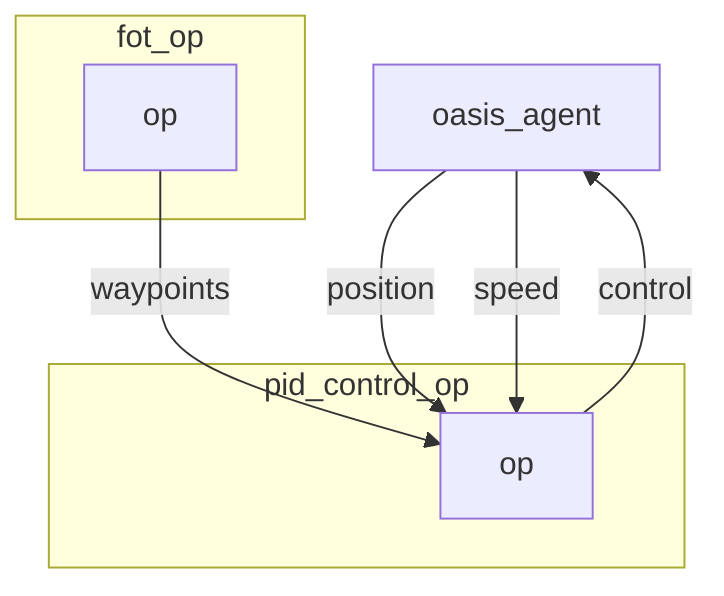

 
# PID Control operator

`pid` control operator computes the command that needs to be executed to follow the given waypoints. 
It reacts to the car current speed and position in a way that accelerates or brake according to previous inputs.

## Inputs

- waypoints coordinates to follow.

## Outputs

- throttle, steering (rad) and braking.

## Graph Description

```yaml
  - id: pid_control_op
    operator:
      python: ../../operators/pid_control_op.py
      outputs:
        - control
      inputs:
        position: oasis_agent/position
        speed: oasis_agent/speed
        waypoints: fot_op/waypoints
```

## Graph Viz



## Hyperparameters consider changing

See: https://en.wikipedia.org/wiki/PID_controller

```
pid_p = 0.1
pid_d = 0.0
pid_i = 0.05
dt = 1.0 / 20   
```


<!---
This file is auto-generated using:
node .scripts/generate-python-operator-doc.js
-->

## Methods

### `__init__()`


<details>
  <summary>Source Code</summary>

```python
    def __init__(self):
        self.waypoints = []
        self.target_speeds = []
        self.metadata = {}
        self.position = []
        self.speed = []
        self.previous_position = []
        self.current_speed = []
        self.previous_time = time.time()


```

</details>

### `.on_event(...)`


<details>
  <summary>Source Code</summary>

```python

    def on_event(
        self,
        dora_event: dict,
        send_output: Callable[[str, bytes], None],
    ) -> DoraStatus:
        if dora_event["type"] == "INPUT":
            return self.on_input(dora_event, send_output)
        return DoraStatus.CONTINUE


```

</details>


### `.on_input(...)`

Handle input.
        Args:
            dora_input["id"]  (str): Id of the input declared in the yaml configuration
            dora_input["value"] (arrow.array(UInt8)): Bytes message of the input
            send_output (Callable[[str, bytes]]): Function enabling sending output back to dora.
        

<details>
  <summary>Source Code</summary>

```python

    def on_input(
        self,
        dora_input: dict,
        send_output: Callable[[str, bytes], None],
    ):
        """Handle input.
        Args:
            dora_input["id"]  (str): Id of the input declared in the yaml configuration
            dora_input["value"] (arrow.array(UInt8)): Bytes message of the input
            send_output (Callable[[str, bytes]]): Function enabling sending output back to dora.
        """

        if "position" == dora_input["id"]:
            self.position = dora_input["value"].to_numpy()
            return DoraStatus.CONTINUE

        elif dora_input["id"] == "speed":
            self.speed = np.array(dora_input["value"])
            return DoraStatus.CONTINUE

        elif "waypoints" == dora_input["id"]:
            waypoints = dora_input["value"].to_numpy()
            waypoints = waypoints.reshape((-1, 3))

            self.target_speeds = waypoints[:, 2]
            self.waypoints = waypoints[:, :2]
            self.metadata = dora_input["metadata"]

        if len(self.position) == 0 or len(self.speed) == 0:
            return DoraStatus.CONTINUE

        if len(self.waypoints) == 0:
            send_output(
                "control",
                pa.array(np.array([0, 0, 1], np.float16).ravel()),
                self.metadata,
            )
            return DoraStatus.CONTINUE

        [x, y, _, rx, ry, rz, rw] = self.position
        [_, _, yaw] = R.from_quat([rx, ry, rz, rw]).as_euler("xyz", degrees=False)
        distances = pairwise_distances(self.waypoints, np.array([[x, y]])).T[0]

        index = distances > MIN_PID_WAYPOINT_DISTANCE
        self.waypoints = self.waypoints[index]
        self.target_speeds = self.target_speeds[index]
        distances = distances[index]

        if len(self.waypoints) == 0:
            target_angle = 0
            target_speed = 0
        else:
            argmin_distance = np.argmin(distances)

            ## Retrieve the closest point to the steer distance
            target_location = self.waypoints[argmin_distance]

            target_speed = self.target_speeds[argmin_distance]

            ## Compute the angle of steering
            target_vector = target_location - [x, y]

            target_angle = get_angle(
                math.atan2(target_vector[1], target_vector[0]), yaw
            )

        throttle, brake = compute_throttle_and_brake(
            pid, LA.norm(self.speed), target_speed
        )

        send_output(
            "control",
            pa.array(np.array([throttle, target_angle, brake], np.float16)),
            self.metadata,
        )
        return DoraStatus.CONTINUE


```

</details>


<!---
This file is auto-generated using:
node .scripts/generate-python-operator-doc.js
-->
