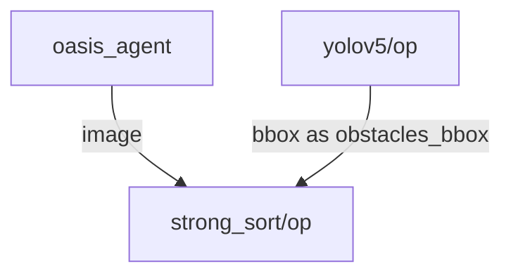

 
# Strong Sort operator

`Strong sort` uses deep learning to uniquely identify bounding boxes in order to track them trough an image stream. 

## Inputs

- image: HEIGHTxWIDTHxBGR array.
- bbox: N_BBOX, X_MIN, X_MAX, Y_MIN, Y_MAX, CONDIDENCE, CLASS, array

## Outputs

- obstacles_id: x1, x2, y1, y2 track_id, class_id, conf

## Example plot (Tracking correspond to the blue # id )


## Graph Description

```yaml
  - id: yolov5
    operator: 
      outputs:
        - obstacles_id
      inputs:
        image: webcam/image
        bbox: yolov5/bbox
      python: ../../operators/strong_sort_op.py
```

## Graph Visualisation




<!---
This file is auto-generated using:
node .scripts/generate-python-operator-doc.js
-->

## Methods

### `__init__()`


<details>
  <summary>Source Code</summary>

```python
    def __init__(self):
        model = StrongSORT(
            "osnet_x0_25_msmt17.pt",
            torch.device("cuda"),
            False,
        )
        model.model.warmup()
        self.model = model
        self.frame = []


```

</details>

### `.on_event(...)`


<details>
  <summary>Source Code</summary>

```python

    def on_event(
        self,
        dora_event: dict,
        send_output: Callable[[str, bytes], None],
    ) -> DoraStatus:
        if dora_event["type"] == "INPUT":
            return self.on_input(dora_event, send_output)
        return DoraStatus.CONTINUE


```

</details>


### `.on_input(...)`


<details>
  <summary>Source Code</summary>

```python

    def on_input(
        self,
        dora_input: dict,
        send_output: Callable[[str, bytes], None],
    ) -> DoraStatus:
        if dora_input["id"] == "image":
            frame = np.array(
                dora_input["value"],
                np.uint8,
            ).reshape((IMAGE_HEIGHT, IMAGE_WIDTH, 4))

            self.frame = frame[:, :, :3]

        elif dora_input["id"] == "obstacles_bbox" and len(self.frame) != 0:
            obstacles = np.array(dora_input["value"]).reshape((-1, 6))
            if obstacles.shape[0] == 0:
                # self.model.increment_ages()
                send_output(
                    "obstacles_id",
                    pa.array(np.array([]).ravel()),
                    dora_input["metadata"],
                )
                return DoraStatus.CONTINUE

            # Post Processing yolov5
            xywhs = xxyy2xywh(obstacles[:, 0:4])
            confs = obstacles[:, 4]
            clss = obstacles[:, 5]
            with torch.no_grad():
                outputs = np.array(
                    self.model.update(xywhs, confs, clss, self.frame)
                ).astype("int32")
                if len(outputs) != 0:
                    outputs = outputs[
                        :, [0, 2, 1, 3, 4, 5, 6]
                    ]  # xyxy -> x1, x2, y1, y2 track_id, class_id, conf

                    send_output(
                        "obstacles_id",
                        pa.array(outputs.ravel()),
                        dora_input["metadata"],
                    )

        return DoraStatus.CONTINUE


```

</details>


<!---
This file is auto-generated using:
node .scripts/generate-python-operator-doc.js
-->
