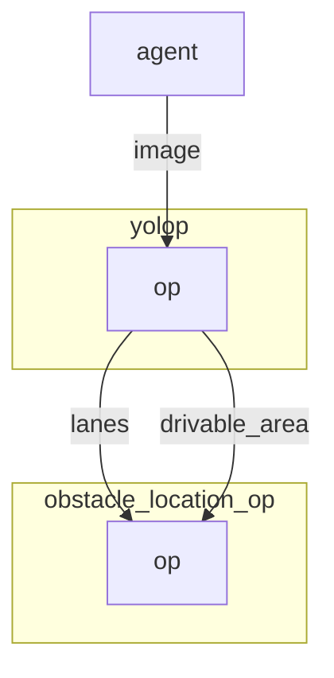

# Yolop operator

`Yolop` object detection operator detects drivable areas and lanes on an image.

More info here: [https://github.com/ultralytics/yolop](https://github.com/ultralytics/yolop)

`Yolop` has not been finetuned on the simulation and is directly importing weight from Pytorch Hub.

The image size must be specified in order to work. By default it is 1920x1080xBGR.

## Inputs

- image as 1920x1080xBGR array.

## Outputs

- Bounding box coordinates as well as the confidence and class label as output.

## Graph Description

```yaml
  - id: yolop
    operator: 
      outputs:
        - bbox
      inputs:
        image: agent/image
      python: ../../operators/yolop_op.py
    env:
      PYTORCH_DEVICE: cuda
```

## Graph visualisation

<div align="center">



</div>